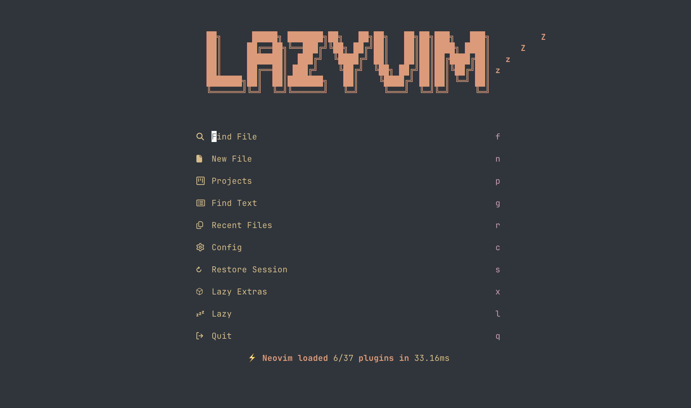

Quando comecei a aprender mais sobre programação, sempre li e ouvi discussões sobre qual seria a melhor _IDE_ (_Integrated Development Environment_) para desenvolvimento de software, e nunca vi uma resposta definitiva. Provavelmente porque ela não existe. No fim das contas, tudo se resume a gosto pessoal.

Sempre gostei bastante do _VS Code_. Me acostumei com ele desde o início da graduação, quando o utilizamos na disciplina de Algoritmos e Programação de Computadores (a.k.a. PROG1). É uma ferramenta robusta, com ótimos complementos para praticamente todas as linguagens com as quais já tive contato.

Com o tempo, comecei a ver muitos vídeos sobre _Vim_ e _Neovim_ no _YouTube_, e isso chamou bastante minha atenção. A proposta é interessante: um editor de texto que roda no terminal e que você pode customizar praticamente sem limites, chegando bem perto de uma _IDE_ completa, só que muito mais leve e flexível. Isso foi o suficiente para me convencer a tentar.

Entre _Vim_ e _Neovim_, acabei optando pelo _Neovim_, principalmente por ele ser um pouco mais amigável para iniciantes e ter um ecossistema mais moderno. Nesse processo, descobri o _LazyVim_, que facilita bastante a configuração inicial e a instalação de _plugins_.

Imagem 1 - Tela inicial do LazyVim

Mesmo já tendo uma noção básica dos comandos, a adaptação não foi simples. Quando começamos a usar o teclado, nos acostumamos a mover o cursor com as setinhas, mas no _Vim/Neovim_ isso muda completamente. Aqui usamos `h`, `j`, `k` e `l` para mover o cursor para a esquerda, baixo, cima e direita, respectivamente. Sim, é estranho no começo. Forçar o uso dessas teclas chega a parecer uma pequena tortura, porque o cérebro insiste em ir para as setas. Ainda assim, decidi persistir e me obrigar a usar os motions.

Depois disso, fui atrás das configurações essenciais para as linguagens que utilizo. Pelo _Mason_, uma ferramenta que já vem integrada ao _LazyVim_, instalei os _LSPs_ (_Language Server Protocol_) para _C/C++, Python, Java_, entre outros, além de algumas ferramentas adicionais, como o _Prettier_. A facilidade para instalar e gerenciar esse tipo de coisa foi uma grata surpresa.

Também acabei modificando algumas _keybinds_ para facilitar meu dia a dia. Um exemplo simples: para selecionar todo o conteúdo de um arquivo no _Vim_, normalmente fazemos `ggVG`, onde `gg` vai para o início do arquivo, `V` entra no modo visual por linha e `G` vai para o final. Apesar de não ser um comando enorme, dá para simplificar bastante. Mapeei tudo isso para `<C-a>`, imitando o clássico `Ctrl + A` dos editores tradicionais. Muito mais prático.

Outra customização interessante foi em relação às janelas. Para abrir uma nova, normalmente é preciso entrar no modo de comando (`:`) e digitar `tabedit`. Para agilizar, criei um atalho (`tr`, no modo normal) que faz isso automaticamente.

_Disclaimer_: ainda não tenho certeza se o termo “janela” é o mais correto aqui. Já vi muita gente se referindo a isso como _buffer_. Ainda estou aprendendo essas distinções.

Também mapeei os comandos `sh`, `sj`, `sk` e `sl` para navegar entre janelas, o que deixou tudo bem mais intuitivo.

Talvez você tenha reparado que mencionei termos como “modo normal” e “modo de visualização”. Essa é uma das principais características do _Vim/Neovim_: ele é um editor modal. No _normal_ mode você usa os _motions_ e comandos para navegar e manipular o texto. No _insert_ mode é onde você realmente digita e edita o conteúdo. Existem outros modos, como o visual, mas ainda não me aprofundei o suficiente neles, então vou deixar isso para outro momento.

Personalizei mais algumas coisas: troquei o tema, ajustei a fonte do terminal e fiz pequenas mudanças estéticas e funcionais. Nada muito avançado, mas o suficiente para deixar o ambiente confortável.

No geral, a experiência inicial com o _Neovim_ foi muito positiva. Estou escrevendo esta própria postagem usando ele agora, o que já diz bastante. Ainda tenho dificuldade com alguns _motions_ e com a troca constante de modos, mas isso faz parte do processo. Também não curti muito os _formatters_ de código, mas isso não é um problema do _Neovim_ em si.

Por enquanto, é isso. Estou animado para continuar usando a ferramenta e, quem sabe no futuro, escrever um novo post contando como foi essa evolução.
